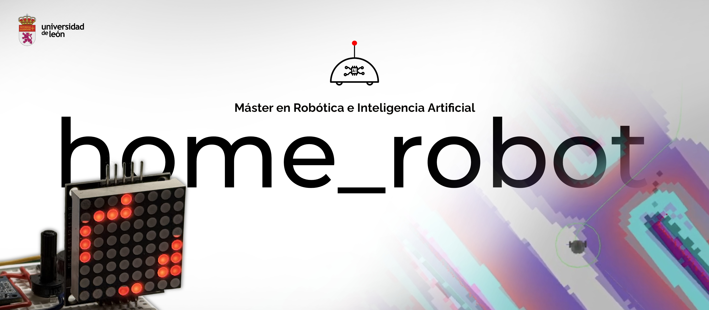

<div align="center">
    <h2><b>University of León | Master's in Robotics and AI | Hugo Díaz</b></h2>
    <h1><b>Home Robot: A ROS 2 Jazzy package for entry-level robotics demonstrations on TB3</b></h1>
</div>

---



---

This project is part of the subject "Service Robotics" in the **[Master's in Robotics and Artificial Intelligence](https://robotica.unileon.es/master/) at the University of Leon** (Spain). Credit to the institution for its training and guidance.

This package includes:

- [Turtlebot3](https://www.turtlebot.com/) with pre-configured Nav2 navigation and SLAM.
- An "ortographic-like" camera and a "go to point" services.
- A brand new home-like environment with pre-defined waypoints.
- A node for voice commands (Spanish-only for now).
- **An Arduino-based hardware interface for display lidar close environment and a buzzer for proximity alerts**

## Requirements

*   **Docker & Docker Compose**: The easiest way to run the project.
*   **Linux (Recommended)**: Best for audio and hardware integration.
*   **PulseAudio**: For voice features. (Note: The project is optimized for host UID `1000`. If your user ID is different, update the `docker-compose.yml` accordingly).

## Quick start (Docker)

1.  **Clone and Start**:
    ```bash
    git clone https://github.com/hugodidi/home_robot.git
    cd home_robot
    docker compose -f docker/docker-compose.yml up -d
    ```

2.  **Access the Desktop**:
    Open your browser at **[http://localhost:6080](http://localhost:6080)** (If asked, the password is `roser`).

3.  **Launch the Robot**:
    Inside the web terminal, run the full navigation stack:
    ```bash
    ros2 launch home_robot main_nav.launch.py use_slam:=true
    ```

4.  **Voice Control**:
    In a new terminal inside the container:
    ```bash
    ros2 run home_robot voice_controller
    ```

> [!TIP]
> If you encounter environment or audio issues, we provide optimized launch scripts in the `scripts/` folder (e.g., `./scripts/launch_voice.sh`). These scripts handle environment sourcing and cleanup automatically for a "clean start".

## Hardware (Arduino)

If you have the physical [Arduino hardware](docs/hardware-components.md), just plug it in and launch the LiDAR grid node from within the container:

```bash
ros2 run home_robot lidar_grid_node --port /dev/{your_arduino_port}
```


# Available Commands   

See the [commands documentation](./docs/commands.md) for a detailed explanation of the available commands and how to use them. 
